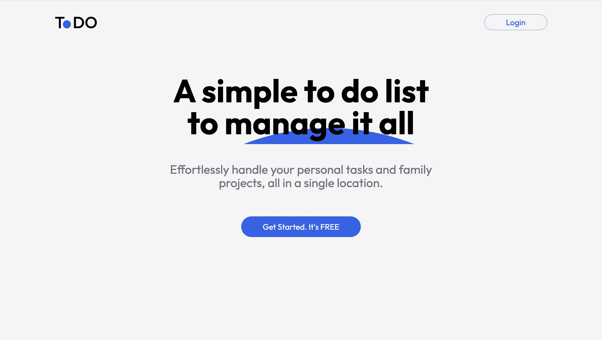
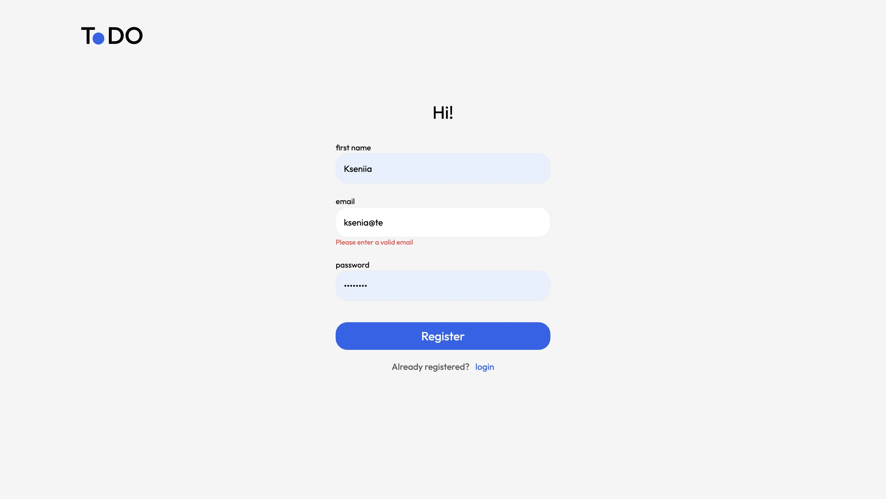
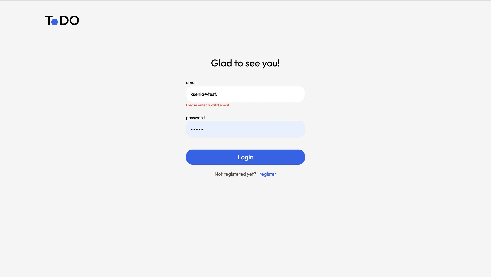
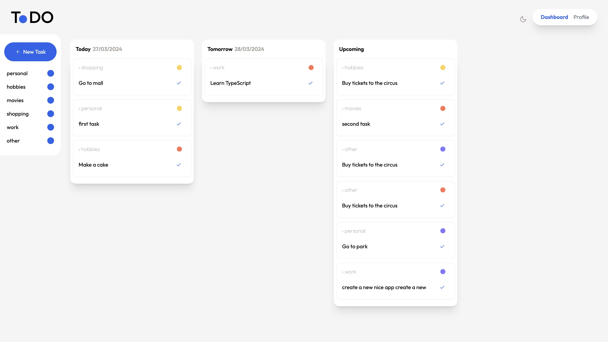
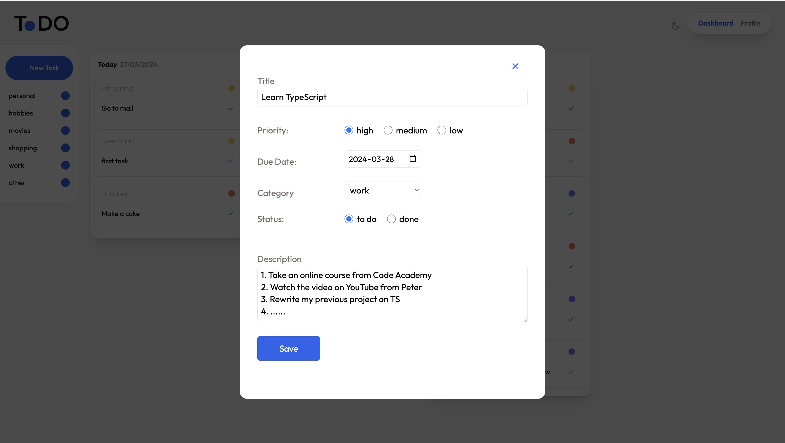
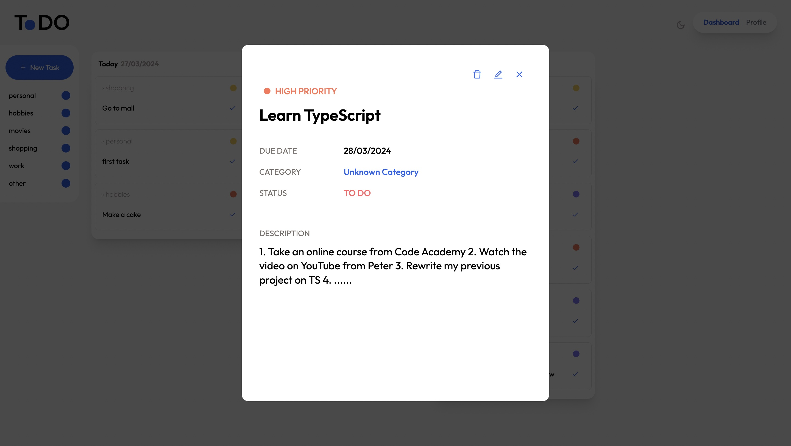
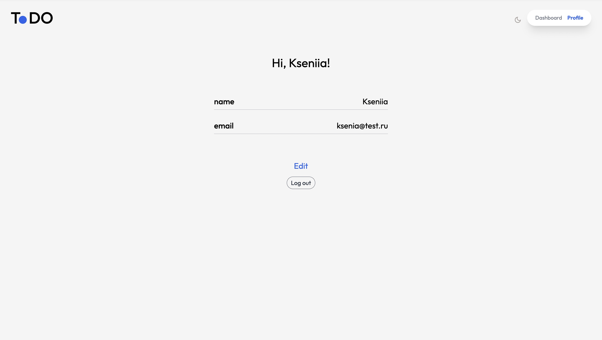

# to-do-app. frontend and backend parts.
Final study project for the Beyond the endpoint module, Hyper Island.

***This is a service where you can create and manage your tasks.***

## Tools and stack: 
* HTML / CSS / React.js / TypeScript / NodeJS /  API / JWT / Sequelize / PG / PostgreSQL / Tailwind
  
## Here's what was done:
* set up infrastructure and created Express server;
* connected database created API schemas and resource models;
* implemented authentication and authorization on the server;
* the backend was deployed on Render;
* components made up in React;
* create the logic and layout of registration, login, profile editing, and tasks pages;
* asynchronous GET-, PATCH-, DELETE- and POST-requests to the API were implemented;
* authorized and unauthorized states and task management in the profile have been worked out.

## Project links:
### Website: [Visit our website](https://to-do-app-git-main-g6d.vercel.app/)

## Project screenshots:
***Start page***


***Registration page***


***Login page***


***Dashboard page***


***Creating a task***


***Task popup***


***User account***



## Project Setup Instructions:
To set up this project locally, follow the steps below:

1. **Clone the Repository:**

    ```bash
    https://github.com/group-6-d/to-do-app.git
    ```
3. **Navigate to the api Folder:**

    ```bash
    cd api
    ```
4. **Running the api (backend part):**
   
    ```bash
    npm run dev
    ```
5. **Open a new terminal window. Navigate to the Frontend Folder:**

    ```bash
    cd frontend
    ```

6. **Install frontend dependencies:**

    ```bash
    npm install
    ```
7. **Running the frontend part:**

    ```bash
    npm run dev
    ```    

8. **Open web site locally**

Now you can interact with the web service: register, log in, log out, edit your profile, create, edit and delete tasks.
    

